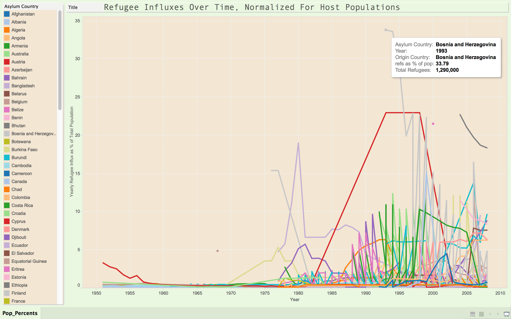

 

## 00. Create/Clone a github repository

 

## 01. Create RStudio Project

 

## 02. Setup RStudio 
 Create three folders in RStudio Project:
 
- **00 Doc**: where .Rmd and graphics folder live    
- **01 Data**: where data, csv's will be stored  
- **02 Tableau Visualizations**: Where visualizations are saved    

## 03. Download .CSV Files

Data taken from http://popstats.unhcr.org/

## 04. ETL & Create Table on Database

CREATE TABLE Refugee_Stats (
 Asylum_Country varchar2(4000),
 Origin_Country varchar2(4000),
 Record_Year number(38,4),
 Refugees number(38,4),
 Asylum_seekers number(38,4),
 Returned_Refugees number(38,4),
 IDPs number(38,4),
 Returned_IDPs number(38,4),
 Stateless_persons number(38,4),
 Others_of_concern number(38,4),
 Total_Population number(38,4)
 );

CREATE TABLE Yearly_Pop_By_Country (
-- Change table_name to the table name you want.
 Country_Name varchar2(4000),
 Country_Code varchar2(4000),
 Indicator_Name varchar2(4000),
 Indicator_Code varchar2(4000),
 X1960 number(38,4),
 X1961 number(38,4),
 X1962 number(38,4),
 X1963 number(38,4),
 X1964 number(38,4),
 X1965 number(38,4),
 X1966 number(38,4),
 X1967 number(38,4),
 X1968 number(38,4),
 X1969 number(38,4),
 X1970 number(38,4),
 X1971 number(38,4),
 X1972 number(38,4),
 X1973 number(38,4),
 X1974 number(38,4),
 X1975 number(38,4),
 X1976 number(38,4),
 X1977 number(38,4),
 X1978 number(38,4),
 X1979 number(38,4),
 X1980 number(38,4),
 X1981 number(38,4),
 X1982 number(38,4),
 X1983 number(38,4),
 X1984 number(38,4),
 X1985 number(38,4),
 X1986 number(38,4),
 X1987 number(38,4),
 X1988 number(38,4),
 X1989 number(38,4),
 X1990 number(38,4),
 X1991 number(38,4),
 X1992 number(38,4),
 X1993 number(38,4),
 X1994 number(38,4),
 X1995 number(38,4),
 X1996 number(38,4),
 X1997 number(38,4),
 X1998 number(38,4),
 X1999 number(38,4),
 X2000 number(38,4),
 X2001 number(38,4),
 X2002 number(38,4),
 X2003 number(38,4),
 X2004 number(38,4),
 X2005 number(38,4),
 X2006 number(38,4),
 X2007 number(38,4),
 X2008 number(38,4),
 X2009 number(38,4),
 X2010 number(38,4),
 X2011 number(38,4),
 X2012 number(38,4),
 X2013 number(38,4),
 X2014 number(38,4)
 );

## 05. Visualizations  

### Visualization 1: A Look at Migration Out of Vietnam

Description: 

This visualization looks at the number of refugees coming out of Vietnam over the years 1964-2008 (filter: Origin Country by Vietnam). The other filter is to ignore any value that is null. The result is a bar chart plotting aggregated number of refugees versus year, colored by asylum country, with a reference line as the average over all years.

Comments:

- We can see clearly that there was an abrupt and permanent increase in the number of refugees in 1979. Though showing a lag in time, this corresponds to the end of the Vietnam War, resulting in the 1975 Union of the Communist North & Capitalist South of Vietnam, with the North holding political power. Hence, the data presents the large number of refugees dissenting the new political regime that sought for asylum in other countries.
- China (colored pink in the bar chart), Vietnam's "big brother", has welcomed the largest portion of Vietnamese refugees.
- The United States (colored blue in the bar chart), also has also taken in quite a number of Vietnamese refugees since 1988. This is interesting considering its involvement in the Vietnam War. (This is 13 years after the war.)

### Visualization 2: Refugees and Country Size

Description: 

Here I attempted a broad survey of asylum-seeking patterns from the perspective of host countries. To accomplish this, I created a calculated field that divided the number of refugees entering a given country in a given year by that country's total population as of 2014. 

Comments:

- We find a notable surge in more refugees entering smaller countries in the late 80's and early 90's, which historically aligns with both the dissolution of the Soviet Union (and the subsequent conflicts in the Balkans) and the start of the Gulf War. Many factors doubtless contribute to refugee movements in both regions, but at the point of surge it is indeed often Middle Eastern and Balkan countries topping the chart.

- Some of the most interesting data in this visualization is contained in the mouseover labels. I've captured one in the above image as an example, but exploring the graph directly will reveal a surprising trend: almost all of the highest outliers in refugees-as-population-percentage are the result of intra-national displacement: that is, in 1993 Bosnia & Herzegovina found more than 1/3 of its own citizens as refugees in its own country. The same is true for all the highest points on Latvia's timeline, Cyprus's, Libera, Timor-Leste's, Sierra Leone's, Lebanon's, and others'. This is consistent with the numerous civil wars erupting in Africa and the Balkans throughout the 1990's.

- Finally, this chart shows a global trend of woefully uneven distribution of refugees and asylum seekers. Obviously the size of a country is not the only determinant in its ability to provide refuge to a particular group, but you'll find no G8 country has ever opened its borders to anywhere near 5% of its population in refugees. The best Western Europe and North America has ever done is Austria in 1951 (the first year of data recorded) at 3.3%

### Visualization 3: Origins and Asylum

-In this visualization, I was interested in exploring if there are any trends in where refugees went based on their origin country. I decided to do a case study of two international powers with advanced economies and trustworthy government records: the United States of America and Germany. 

-I was only interested in the number of fefugees and the number of people seeking asylum, and I needed these numbers to be seperate for the calculations. I did two seperate SQL statements which mutated the pertinent columns for USA and GER data, and then performed an inner join on this data along the 'Origin_Country' column.

-I then created two calculated fields that found the ratio of refugees to people who sought asylum, one for each country. The ratio of these ratios is the KPI I used, and it tells us if refugees were more likely to seek asylum in Germany or the United States. I used this information to create the cross tab displayed below.

-There are some interesting things we can glean from this information. It appears that the relations between the country of origin and the country of asylum may be important factors in determining if refuges seek official, permanent residence (asylum). A far greater ratio of people from Iran and Iraq saught asylum in Germany than they did in the USA, and the exact oposite it due for those originating in Israel (completely unsuprising statistics).  

-A second interesting trend is that people originating on the American continent are equalily likely, if not more likely, to apply for asylum in the USA than they are to simply be refugees (Key examples: Argentina, Brazil, Mexico, Canada, etc etc). However, this trend is NOT consistent in Germany, where there seems to be a random dispersion of Asylum Applicants to refugees from Europe. Countries like England, Spain, and Belgium have almost no records of Asylum seekers. This could be due to the very open borders between those countries, and a relatively small number of catastrophies and conflicts in the region. In almost all of the European cases, the United States had both a higher number of Asylum Seekers, and a higher ratio of Asulum Seekers to Refugees. I'm not sure what to attribpute this to. One could say that those willing to travel to America recognize the difficulty of moving back to their homeland, and therefore apply for perminent residence instead, whereas it is relatively easy to move around in Europe, so they could very easily return home after whatever drove them out ended. However, this is just a theory, and we would need a more through analysis to delve to the bottom of this question.

