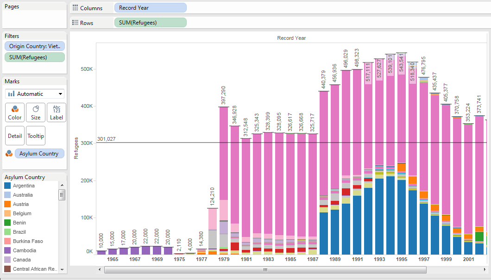
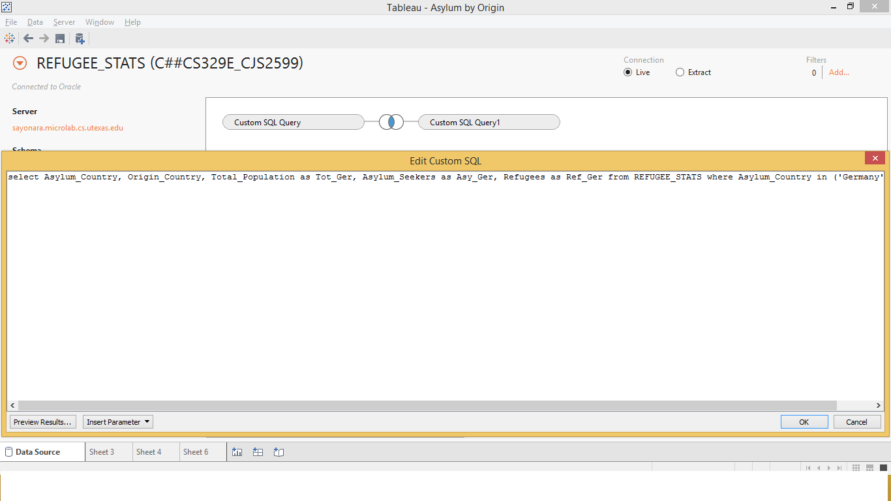
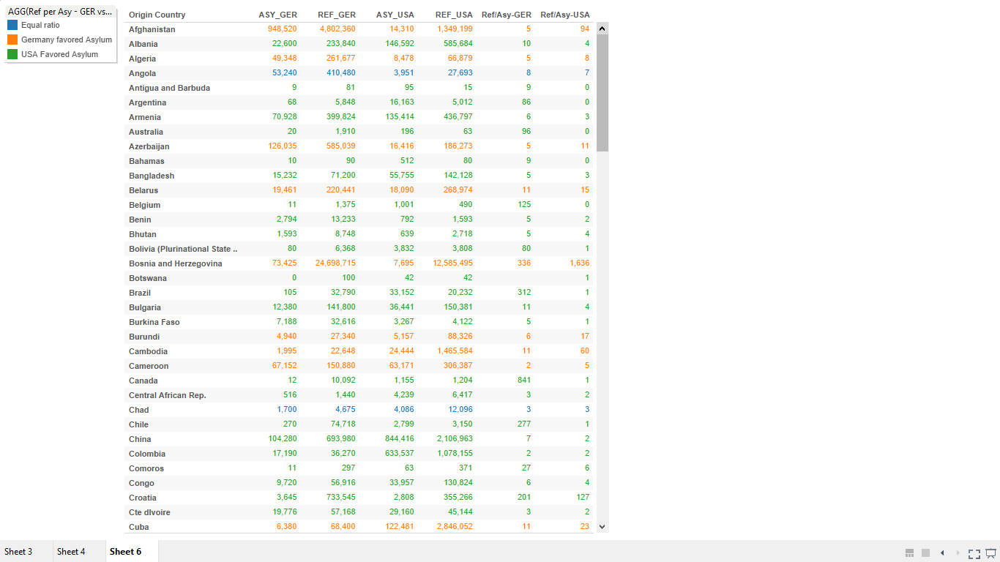
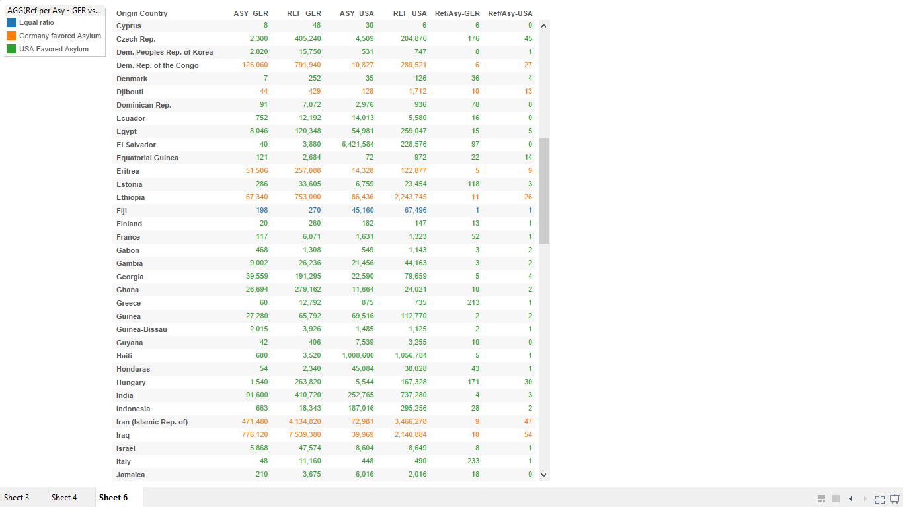
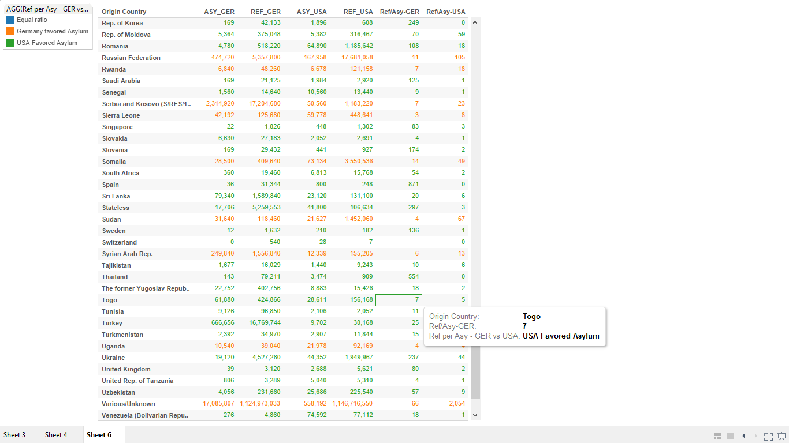

 

## 00. Create/Clone a github repository

 

## 01. Create RStudio Project

 

## 02. Setup RStudio 
 Create three folders in RStudio Project:
- **00 Doc**: where .Rmd and graphics folder live
- **01 Data**: where data, csv's will be stored
- **02 Tableau Visualizations**: Where visualizations are saved  

## 03. Download .CSV Files

Data taken from http://popstats.unhcr.org/

## 04. ETL & Create Table on Database

CREATE TABLE Refugee_Stats (
 Asylum_Country varchar2(4000),
 Origin_Country varchar2(4000),
 Record_Year number(38,4),
 Refugees number(38,4),
 Asylum_seekers number(38,4),
 Returned_Refugees number(38,4),
 IDPs number(38,4),
 Returned_IDPs number(38,4),
 Stateless_persons number(38,4),
 Others_of_concern number(38,4),
 Total_Population number(38,4)
 );

CREATE TABLE Yearly_Pop_By_Country (
-- Change table_name to the table name you want.
 Country_Name varchar2(4000),
 Country_Code varchar2(4000),
 Indicator_Name varchar2(4000),
 Indicator_Code varchar2(4000),
 X1960 varchar2(4000),
 X1961 varchar2(4000),
 X1962 varchar2(4000),
 X1963 varchar2(4000),
 X1964 varchar2(4000),
 X1965 varchar2(4000),
 X1966 varchar2(4000),
 X1967 varchar2(4000),
 X1968 varchar2(4000),
 X1969 varchar2(4000),
 X1970 varchar2(4000),
 X1971 varchar2(4000),
 X1972 varchar2(4000),
 X1973 varchar2(4000),
 X1974 varchar2(4000),
 X1975 varchar2(4000),
 X1976 varchar2(4000),
 X1977 varchar2(4000),
 X1978 varchar2(4000),
 X1979 varchar2(4000),
 X1980 varchar2(4000),
 X1981 varchar2(4000),
 X1982 varchar2(4000),
 X1983 varchar2(4000),
 X1984 varchar2(4000),
 X1985 varchar2(4000),
 X1986 varchar2(4000),
 X1987 varchar2(4000),
 X1988 varchar2(4000),
 X1989 varchar2(4000),
 X1990 varchar2(4000),
 X1991 varchar2(4000),
 X1992 varchar2(4000),
 X1993 varchar2(4000),
 X1994 varchar2(4000),
 X1995 varchar2(4000),
 X1996 varchar2(4000),
 X1997 varchar2(4000),
 X1998 varchar2(4000),
 X1999 varchar2(4000),
 X2000 varchar2(4000),
 X2001 varchar2(4000),
 X2002 varchar2(4000),
 X2003 varchar2(4000),
 X2004 varchar2(4000),
 X2005 varchar2(4000),
 X2006 varchar2(4000),
 X2007 varchar2(4000),
 X2008 varchar2(4000),
 X2009 varchar2(4000),
 X2010 varchar2(4000),
 X2011 varchar2(4000),
 X2012 varchar2(4000),
 X2013 varchar2(4000),
 X2014 varchar2(4000),
 X2015 varchar2(4000)
 );

## 05. Visualizations  

#### Visualization: A Look at Migration Out of Vietnam

Description: 

This visualization looks at the number of refugees coming out of Vietnam over the years 1964-2008 (filter: Origin Country by Vietnam). The other filter is to ignore any value that is null. The result is a bar chart plotting aggregated number of refugees versus year, colored by asylum country, with a reference line as the average over all years.

Comments:

- We can see clearly that there was an abrupt and permanent increase in the number of refugees in 1979. Though showing a lag in time, this corresponds to the end of the Vietnam War, resulting in the 1975 Union of the Communist North & Capitalist South of Vietnam, with the North holding political power. Hence, the data presents the large number of refugees dissenting the new political regime that sought for asylum in other countries.
- China (colored pink in the bar chart), Vietnam's "big brother", has welcomed the largest portion of Vietnamese refugees.
- The United States (colored blue in the bar chart), also has also taken in quite a number of Vietnamese refugees since 1988. This is interesting considering its involvement in the Vietnam War. (This is 13 years after the war.)

###Origins and Asylum

-In this visualization, I was interested in exploring if there are any trends in where refugees went based on their origin country. I decided to do a case study of two international powers with advanced economies and trustworthy government records: the United States of America and Germany. 

-I was only interested in the number of fefugees and the number of people seeking asylum, and I needed these numbers to be seperate for the calculations. I did two seperate SQL statements which mutated the pertinent columns for USA and GER data, and then performed an inner join on this data along the 'Origin_Country' column.

-I then created two calculated fields that found the ratio of refugees to people who sought asylum, one for each country. The ratio of these ratios is the KPI I used, and it tells us if refugees were more likely to seek asylum in Germany or the United States. I used this information to create the cross tab displayed below.

-There are some interesting things we can glean from this information. It appears that the relations between the country of origin and the country of asylum may be important factors in determining if refuges seek official, permanent residence (asylum). A far greater ratio of people from Iran and Iraq saught asylum in Germany than they did in the USA, and the exact oposite it due for those originating in Israel (completely unsuprising statistics).  

-A second interesting trend is that people originating on the American continent are equalily likely, if not more likely, to apply for asylum in the USA than they are to simply be refugees (Key examples: Argentina, Brazil, Mexico, Canada, etc etc). However, this trend is NOT consitent in Germany, where there seems to be a random dispersion of Asylum Applicants to refugees from Europe. Countries like England and Spain have almost no 

